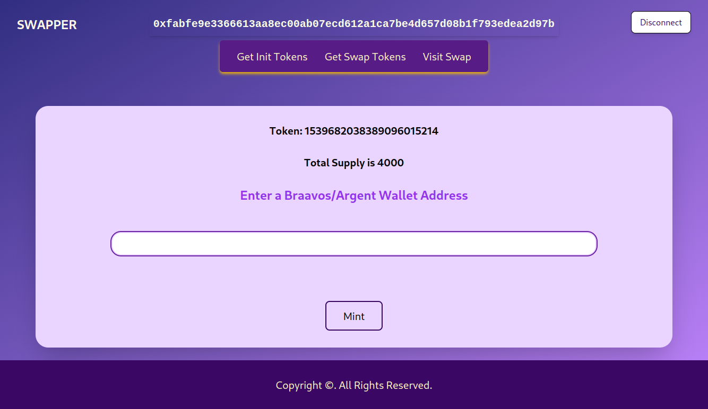
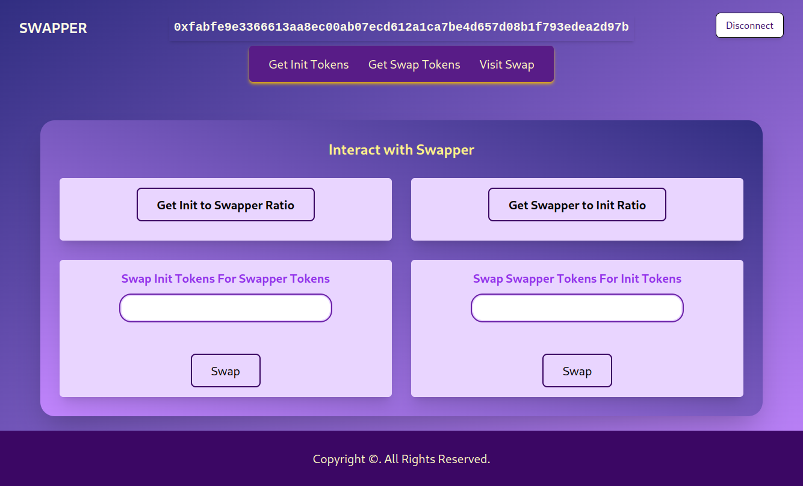

# tokenswap

A decentralized token exchanger

TokenSwap aims to revolutionalize exchange services, by providing secured decentralized exchange services at great rates. Still a work in progress.

TokenSwap Features three Smart Contracts

# 1. Init Token Contract -

The initial token to be swapped can be seen at https://goerli.voyager.online/contract/0x0001a5cf7662dd884123aa8020f417521152789a1d01b0ef1188a25461decca7

# 2. Swap Token Contract -

The swap token to be exchanged with init tokens can be interacted with here https://goerli.voyager.online/contract/0x0571ce0e4d85fb6b0406fad82996ea8dead2700812c3521227f4e8a66ff8dc79

# 3. Swapper Contract -

The main dex contract that handles the logic of the simple and minimal decentralied exchange, to swap approval needs to be granted to the init or swap token contracts and users need to have minted into their wallets the tokens to be swapped, this swapper contract can be interacted with here https://goerli.voyager.online/contract/0x03bc0ba6254229e63fd9bdaaf82c4e2ab0640a8ea5265804d5250d095541943e

To Interact with the dapp as the build is still served locally, kindly do the following
`git clone https://github.com/faytey/tokenswap.git`
then `cd tokenswap && cd swap-dapp`
`npm install`
`npm run start`
